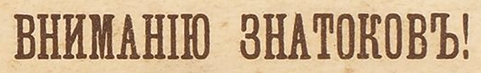
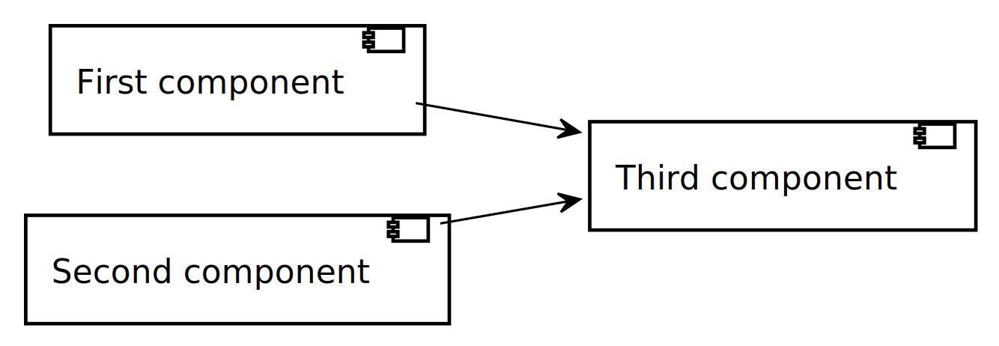
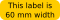
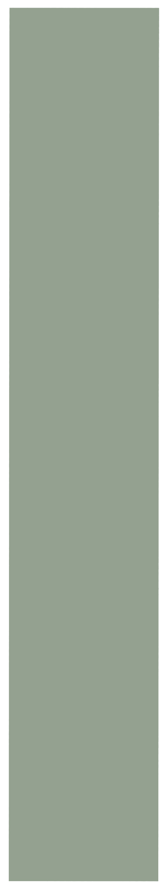

= Test document{nbsp}title (test escape{nbsp}characters in{nbsp}title: ',{nbsp}",{nbsp}<,{nbsp}>,{nbsp}&)
:xrefstyle: short
:sectnums:
:stem:
:mathematical-format: svg
:doctype: book
:source-highlighter: rouge
:toc: center
:toclevels: 5
:toc-title: Table of contents (Asciidoctor)

:base64-image-example: data:image/png;base64,iVBORw0KGgoAAAANSUhEUgAAAAUAAAAFCAYAAACNbyblAAAAHElEQVQI12P4//8/w38GIAXDIBKE0DHxgljNBAAO9TXL0Y4OHwAAAABJRU5ErkJggg==

Some sort of [((preamble))]
multiline paragraph.

Another preamble paragraph.

|===
|preamble table
|===

[dedication]
== Dedication

Some dedication (((preamble, good preamble)))

中文文字

Texte français

ein Löwe

Русский текст

== Links

https://asciidoctor.org/[Asciidoctor]

== Diagram extension

.A diagram in adoc file
[plantuml, diagram-classes, png, fitrect="170x225mm", srcdpi=300, width = "70%"]
....
skinparam dpi 300

class BlockProcessor
class DiagramBlock
class DitaaBlock
class PlantUmlBlock

BlockProcessor <|-- DiagramBlock
DiagramBlock <|-- DitaaBlock
DiagramBlock <|-- PlantUmlBlock
....

== Listings

.Asciidoc listing
[source, asciidoc]
----
Rouge doesn't support asciidoc
----

.Some ruby listing
[source, ruby]
----
class BasicParagraph < BasicHelper <1> <2>
  def h_parent_style_name <2>
    @sd[:parent_style_name] = $defsn_p
    a = b + <3>
        abc[1]
  end
end
----
<1> Property setter class should inherit BasicHelper
<2> Another callout and methods should start with `h_`
<3> And something else

.In lists
* List item 1
+
[source, ruby]
----
class OneMore <1>
end
----
<1> One more class
* List item 2

.In table
|===
a|
[source, xml]
----
<a>
  <b c="d"> <1>
    e
  </b>
</a>
----
<1> Tag with an attribute

|===

== Examples

.Optional title
[example]
This is an example of an example block.

====
The book hit the floor with a *thud*.

He could hear doves *cooing* in the pine trees`' branches.
====

|===
a|
.Example in table
====
.Table list example
* List item 1
* List item 1

[cols="1,2"]
!===
!Just for the fun of it
a!
.Some header
[example]
A deeply digged example. Interesting to see the number
!===
====
|===

== Admonitions

Some text.

[IMPORTANT]
.Feeding the Werewolves
====
While werewolves are hardy community members, keep in mind the following dietary concerns:

. They are allergic to cinnamon.
. More than two glasses of orange juice in 24 hours makes them howl in harmony with alarms and sirens.
. Celery makes them sad.
====

Some text.

NOTE: Inline admonition

== Test equations

Reference to equation <<eq-1>>.

[latexmath]
++++
C = \alpha + \beta Y^{\gamma} + \epsilon
++++

[[eq-1]]
[latexmath]
.({counter: eq})
++++
\begin{bmatrix}
a & b \\
c & d
\end{bmatrix}\binom{n}{k}
++++

And here is an inline equation stem:[sqrt(4) = 2].

== Test discrete

[discrete]
=== Discrete heading

Some text

[discrete]
===== One more discrete heading

Some more text

== Test footnotes

The example of footnotefootnote:f1[A referenced footnote] and its referencefootnote:f1[]. Just a simple footnotefootnote:[Just a footnote].

== Test images 1

.Base64 image example
image::{base64-image-example}[width=10%]

 Asciidoc inline icon, defined in pixels (20px), here is a long text to make this icon fall at least to the second line: . And some text after to have at least third line after this icon, just to see how does it influence line spacing.

The example of Asciidoc inline Base64 icon without width dimensions, it is 5px. Assuming 100 dpi resolution it should have smaller height than its line: image:{base64-image-example}[]. And some text after to have at least third line after this icon, just to see how does it influence line spacing.

This label height should be exactly 5mm in height: 

.SVG example

.SVG example 60x20

.Spring slush
image::rasputicza.jpg[width=100%]

== Vertical image test

Both images should look the same way in browser (10%), but differently in odt.

.Ruler, made to fit page vertically (if condidered 500dpi)

.Ruler, made to fit page vertically (if considered 100dpi)

:!sectnums:

== Test Lists (this section heading is without a number)

:sectnums:

[square]
.Marked list heading
* First point (long line with fitted width)
+
image::long_line.png[]
** Subpoint 1 (long line with fitted width)
+
image::long_line.png[]
. And a little mix-in (short line that shouldn't be fitted due to size)
+

** Subpoint 2
* Second point with no bullet
* Third point
[no-bullet]
** Non-bulleted subpoint 1
** Non-bulleted subpoint 2

.Numbered list heading
. First point
+
.Admonition in list heading
[WARNING.list-level1-admonition] 
==== 
Here the custom role `list-level1-admonition` is applied
====
.. Subpoint 1
... Subsubpoint 1
... Subsubpoint 2
.. Subpoint 2
. Second point
+
Second point continuation. For example some large paragraph, that describes the jist by all necessary means.
. Third point
.. Third sub point

+ 
Third point (not sub) continuation. For example some large paragraph, that describes the jist by all necessary means.
. Forth point

[.landscape]
== A Test Section 1 (landscape)

Example of _italic_, *bold*, ~subscript~, ^superscript^, #simply marked#, [small]#small text#, [big]#big text#, [underline]#underlined text#, and `monospaced`.

Example of inline break +
next string

Example of informal table with no vertical lines.

[frame=topbot, grid=rows]
|===
|a1 a|b1 [small]#small in table# [underline]#underlined in table#
|a2 |b2
|a3 |b3
|a4 |b4
|===

[.portrait]
=== A Test Section 1.1 (portrait)

A Table (<<t1>>) Test paragraph text. A Test paragraph text. A Test paragraph text. A Test paragraph text. A Test paragraph text. A Test paragraph text. A Test paragraph text.

[.text-align-center]
A Test centered paragraph text. A Test centered paragraph text. A Test centered paragraph text. A Test centered paragraph text. A Test centered paragraph text. A Test centered paragraph text. A Test centered paragraph text. A Test centered paragraph text. A Test centered paragraph text.

[[t1]]
[cols="4,1,3", options="header, unbreakable"]
.Table title
|===
^|a1 centered

.^|b1 centered vertically
|c1 Here a very long multiline text is situated in order to show that vertical alignment works
2+a|a2 spanned

Asciidoc contents

* a
. a1
. a2
+
And some text as a paragraph to check paragraph in list alignment
* b

|c2
h|a3 (cell header)
.2+|b3 spanned vertically
^|c3 just centered
|a4

|c5
2+a|
a5
[cols="1,1"]
!===
!sa1 !sa2
!sb1 !sb2
!===
|b5
a|
a6

CAUTION: Inline in table

2+a|
b6

.Table TIP caption
[TIP]
====
And some TIP in a table
====
3+|a7
3+|a8
3+|a9
3+|a10

|===

[.text-align-right]
A Test right-aligned paragraph text.

== Some long, very long, very very long, very very very long, very very very very long h e a d i n g of level 1 (doesn't hang over page number)
=== Some long, very long, very very long, very very very long, very very very very long h e a d i n g of level 2
=== Some another with possible break above long, very long, very very long, very very very long, very very very very long h e a d i n g of level 2
==== Some long, very long, very very long, very very very long, very very very very long h e a d i n g of level 3
===== Some long, very long, very very long, very very very long, very very very very long h e a d i n g of level 4
====== Some long, very long, very very long, very very very long, very very very very long h e a d i n g of level 5

[appendix]
== Appendix example

An appendix
